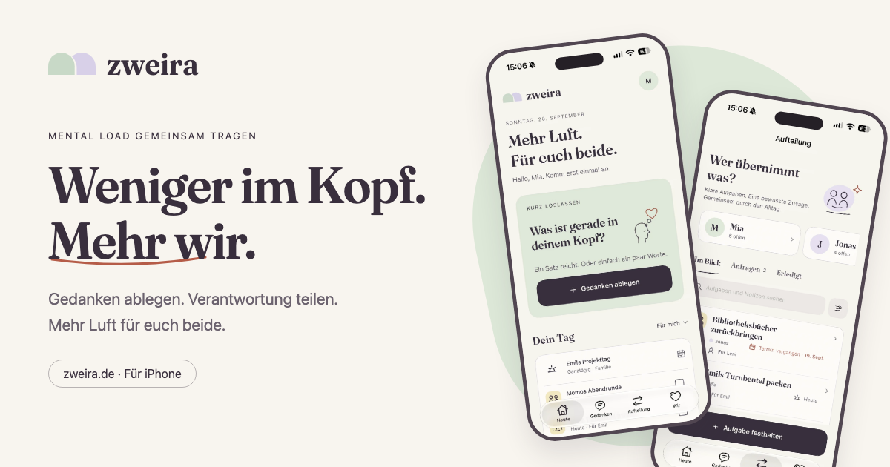

# Zweira — less on your mind, more us

The official website for **Zweira**, an iPhone app that helps couples and households share the mental load: a private place for thoughts, clear responsibility for shared tasks, and more breathing room together.

**[Visit zweira.de](https://zweira.de)** · **[View the app on the German App Store](https://apps.apple.com/de/app/zweira-share-the-mental-load/id6814119210)** · **[Contact](mailto:hallo@justanothercoder.de)**



## What this repository contains

This is the public source of Zweira's German marketing website, its legal pages, and its first-party visual assets. It is a standalone static site built with semantic HTML, CSS, and vanilla JavaScript. There is no framework, build step, package installation, or backend to configure.

The native iOS app, household data, CloudKit configuration, purchase verification, and App Store publishing are **not** part of this repository. The website describes the product; it does not connect to a user's household or process purchases.

## Website experience

- Four real app screenshots in a keyboard-accessible preview: Today, Thoughts, Responsibilities, and Us.
- Five images from the German App Store campaign in a manually controlled, swipeable gallery.
- An interactive example of an accepted or declined task handoff, clearly labeled as an example.
- A clear explanation of private thoughts, a shared household, free features, and optional Pro features.
- Direct links to the German App Store, including an iOS Smart App Banner.
- Locally hosted Fraunces fonts, warm paper colors, and gently animated hand-drawn SVG illustrations.
- Responsive layouts, native FAQ disclosures, visible keyboard focus, reduced-motion support, and an optional animation pause control.
- Canonical URLs, Open Graph artwork, structured application metadata, a sitemap, and a custom 404 page.

The website is German. The **app** supports German and English.

## Run locally

Requirements: Python 3 and a modern browser. Any static HTTP server also works.

```sh
git clone https://github.com/faciendum/Zweira-Webseite.git
cd Zweira-Webseite
python3 -m http.server 8080 --bind 127.0.0.1
```

Open **http://127.0.0.1:8080/**. Stop the server with `Ctrl+C`.

Use an HTTP server rather than opening the HTML file directly: root-relative navigation on the legal and 404 pages expects the site to be served at a domain root.

## Repository structure

```text
.
├── index.html              # German landing page, SVG symbols, metadata and FAQs
├── styles.css              # Shared design system and responsive landing-page styles
├── app.js                  # Navigation, screenshot tabs, gallery, demo and motion controls
├── datenschutz.html        # Privacy information for the website and app
├── impressum.html          # Operator and contact information
├── legal.css               # Legal-page typography and layout
├── 404.html                # Custom not-found page
├── robots.txt              # Crawler instructions and sitemap location
├── sitemap.xml             # Canonical public pages
├── CNAME                   # Custom GitHub Pages domain
├── .nojekyll               # Publish static files without Jekyll
├── assets/
│   ├── screenshots/        # Optimized original German app captures
│   ├── stories/            # Optimized approved App Store marketing images
│   ├── social-preview.png  # 1200 × 630 social sharing artwork
│   ├── *.ttf              # Locally hosted Fraunces fonts
│   └── OFL-Fraunces.txt    # Font license
├── docs/
│   ├── CONTENT.md          # Product facts, copy, screenshots and accessibility guidance
│   └── DEPLOYMENT.md       # Hosting, domain, release checks and repository metadata
├── CONTRIBUTING.md         # Scope and contribution workflow
└── SECURITY.md             # Private vulnerability reporting
```

## Product facts to preserve

| Area | Intended behavior |
| --- | --- |
| Private thoughts | Stored on the person's device; not automatically shared or personally synced through iCloud. |
| Shared household | One owner and one invited person use their own iCloud accounts. Sharing the household does not require Pro or membership in the same Apple Family. |
| Tasks and responsibility | Both people see shared tasks. Responsibility changes only when the requested handoff is accepted. |
| Children, relatives, and pets | Context for tasks, not additional signed-in users. |
| Free features | Thoughts, ordinary household tasks and dates, invitations, family context, and the complete JSON export. |
| Optional Pro | Reminders, widgets, calendar integration, new routines, insights and achievements, task feedback, custom colors, and a readable plan export. |
| Purchase options | Annual auto-renewing subscription or lifetime non-consumable purchase. Prices come from the app's live StoreKit products, not this website. |
| Apple Family Sharing | Shares an eligible Pro purchase when Apple's product and account settings permit it. It does not invite someone into a household or share private thoughts. |

These descriptions do not certify live CloudKit provisioning, App Store product availability, or a successful two-account device test. Native-app release validation is a separate process.

## Editing and verification

1. Edit copy, links, and metadata in `index.html`; update legal pages only when the underlying facts change.
2. Keep visual changes within the existing color, typography, and illustration system in `styles.css`.
3. Keep interactions in `app.js` independent of accounts, external scripts, analytics, and persistent browser storage.
4. Follow [the content guide](docs/CONTENT.md) when replacing screenshots or describing product behavior.
5. Before publishing, use the focused [release checklist](docs/DEPLOYMENT.md#release-checklist).

No automated test suite or build pipeline is configured. JavaScript syntax can be checked with Node.js, if installed:

```sh
node --check app.js
git diff --check
```

## Hosting and privacy

The public site is served at **https://zweira.de** through **GitHub Pages**. It only needs the static files in this repository. See [deployment notes](docs/DEPLOYMENT.md) before changing the publishing branch, domain, or host.

There are no site-owned analytics, advertising scripts, cookies, or local-storage preferences. Interactions stay in the visitor's browser. GitHub Pages still processes technical request data as described in the [privacy page](https://zweira.de/datenschutz.html).

## Contributing and security

Read [CONTRIBUTING.md](CONTRIBUTING.md) for small, focused changes. Report security issues privately using [SECURITY.md](SECURITY.md); do not publish personal app data or credentials in issues or pull requests.

## Assets and licensing

Fraunces is distributed under the [SIL Open Font License](assets/OFL-Fraunces.txt). The screenshots use intentionally created example content.

No general open-source license is granted for this repository. Public visibility does not grant permission to redistribute the Zweira brand, app screenshots, website artwork, or code outside the rights provided by GitHub's terms and applicable law. Contact the maintainer before reusing those materials. Third-party font permissions remain governed by their included license.

Maintained by **Justanothercoder**. Support: **[hallo@justanothercoder.de](mailto:hallo@justanothercoder.de)**.
